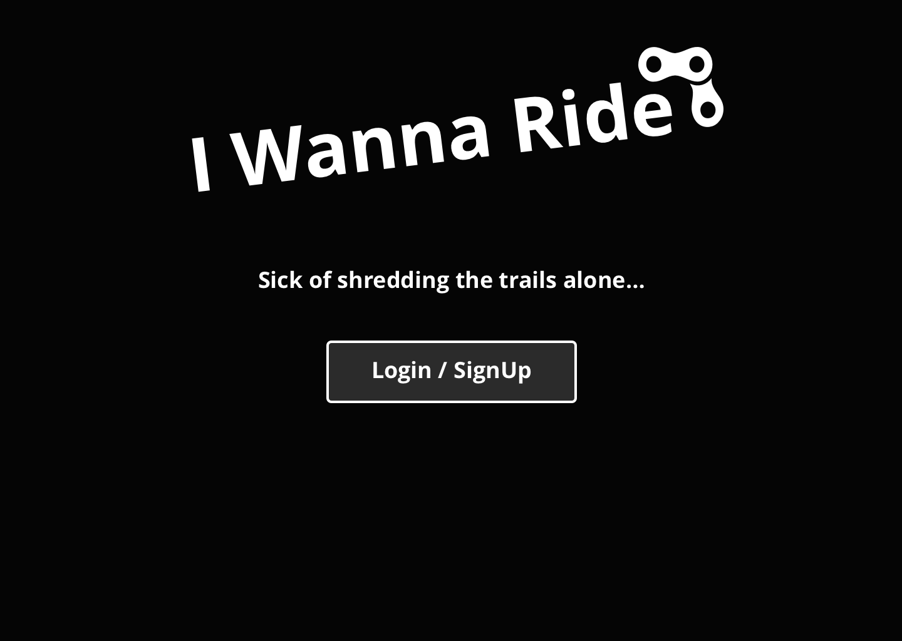
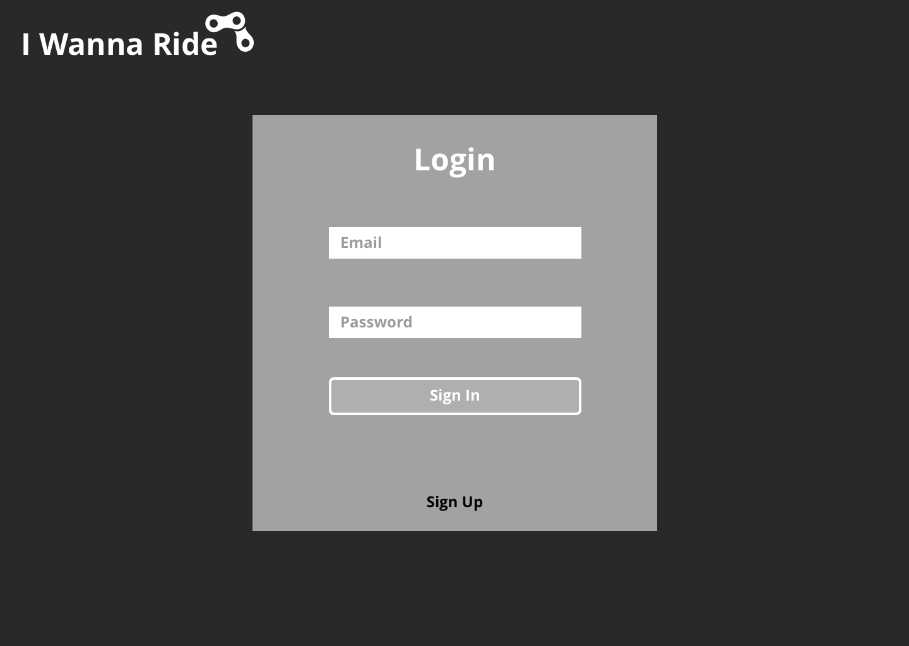
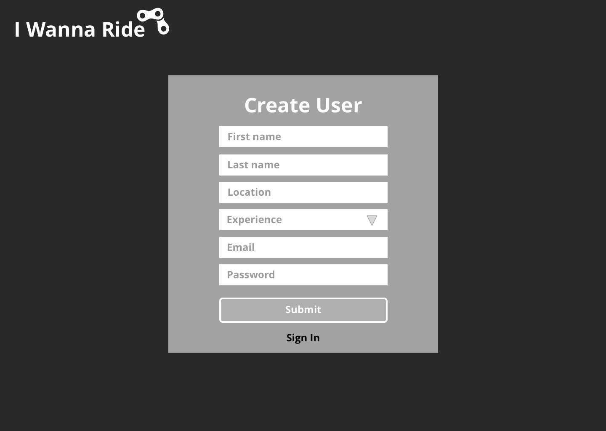
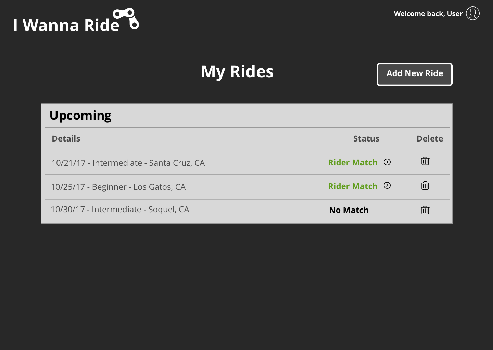
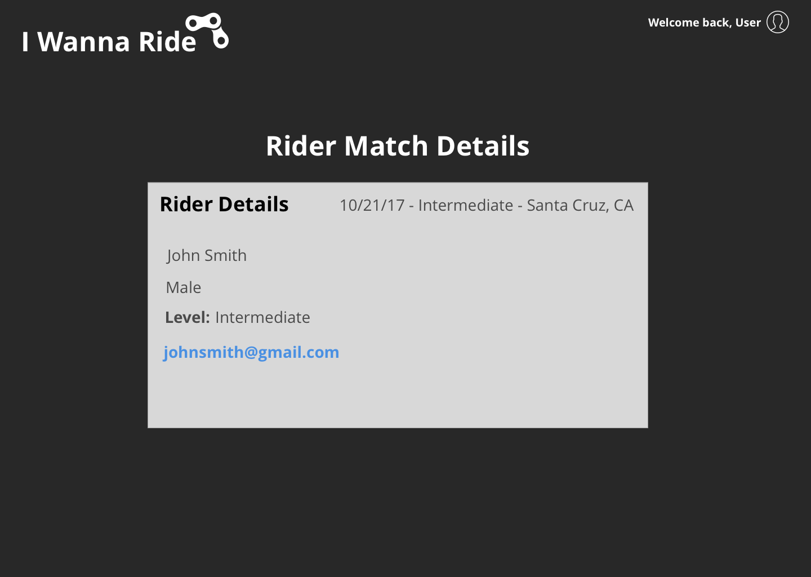
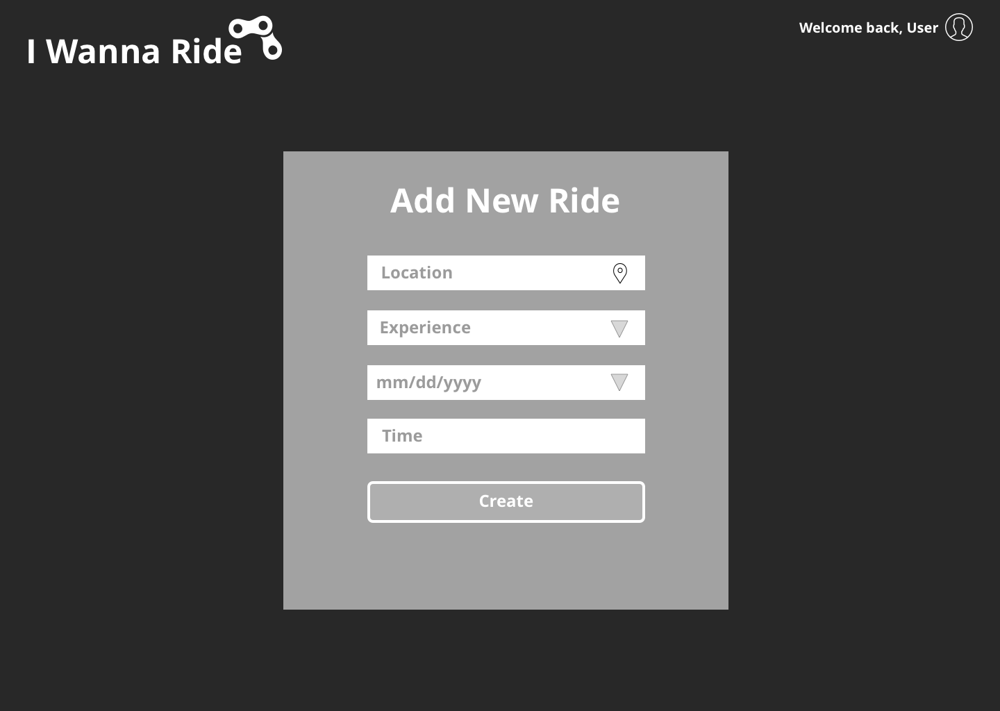

### Student: Mike Fenwick

### Project Name: I Wanna Ride

#### Check In: 1  

#### Collaborators:  
Working alone

#### Project Pitch  
An application that allows mountain bike riders to submit their upcoming lone ride and check if another rider is looking to ride the same area/date/time.
The idea is to match lone MTBers looking to ride the same area on the same day as someone else within the system.

### Deliverables  

#### APIs:  
* [Trailforks](https://www.trailforks.com/about/api/) <----- Waiting for API key
* [Google Maps](https://developers.google.com/maps/web/)

#### Wireframes  

#### Waffle.io

[waffle](https://waffle.io/Mickyfen17/i-wanna-ride)

### Reflection  

#### Order Of Attack  
* Set up Redux store and Router.
* Start from home page and begin with creating users and saving within database.

#### Nice To Haves   
* Up to date trail information.
* A user rating system.
* A user notification system.

#### Biggest Challenges  
* Adding the correct data and creating a good match of users.
* Utilizing Google places API if Trailforks API does not come through.
