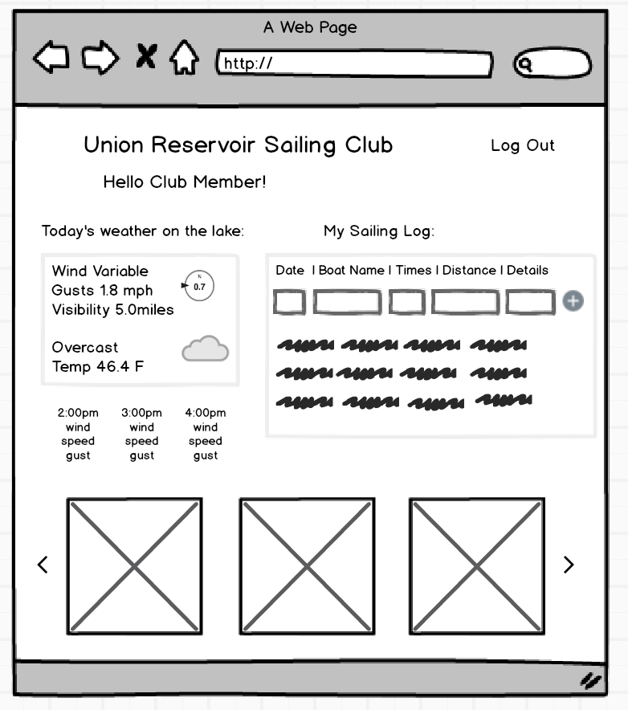

### Student:

Justyna Winiarska-Field

### Project Name:  

Union Reservoir Sailing Club App

#### Check In: 1  

#### Collaborators:  
Are you working with anyone else?

No, I am doing this project by myself.

#### Project Pitch  
Now that you've had a few more days to dig into your project ideas, summarize your newly finalized plan.

The project I want to build is a web app for a sailing racing club at Union Reservoir. It willl be a site where user can check the weather: wind speed, wind direction, hourly forecast for the day (are there any storms coming, etc.), possibly it will include water temperature as well. After logging in, user will be able to see their sailing/racing log (date/time/boat name/race type/distance/race details). That information can be added and updated and persists on page after each login. The web page can also feed racing results of the club, or pictures taken by members.

### Deliverables  

#### Stack:
Redux, React, React Router

#### APIs:  
Links to any API docs that you have decided to use

https://www.wunderground.com/personal-weather-station/dashboard?ID=KCOLONGM164#history

#### Wireframes  
Include screenshots to wireframes or comps of **EVERY PAGE** of the MVP of your app. You can include these by adding additional files to your submissions directory, or linking to an imgur account. You're asked to use Sketch, or Balsamiq, or a different digital wireframe/comp application but if you choose to use pen/paper please let your instructors know and bring those to class Monday. 

#### Waffle.io
Link to your waffle.io account with at least 10 cards indicating baby steps to how you want to structure your attack.  

### Reflection  

#### Order Of Attack  
Based on your wireframes, in what order are you going to approach building out this application?

I will start with setting up redux, make a fetch call to feed in the needed data. Then I will build out my React components. I will test as I go.

#### MVP
Weather/Wind Forecast
Sailing Log

#### Nice To Haves   
What are your reach features?

Login/Logout Functionality
Page Router
Carousel for images

#### Biggest Challenges  
What do you forsee being the biggest challenges of this project? List at least 3 resources you've thought of to help overcome these challenges.

Redux and testing
Resources: Turing lectures, class small projects, MovieTracker project, swapibox for testing reference, Wes Bos tutorial
