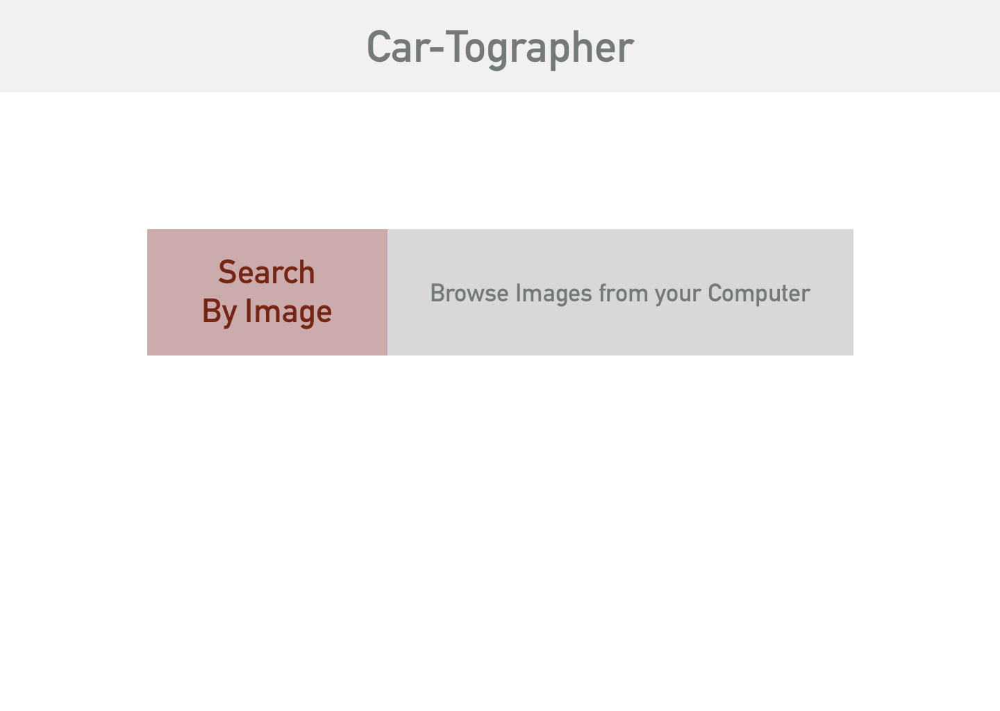
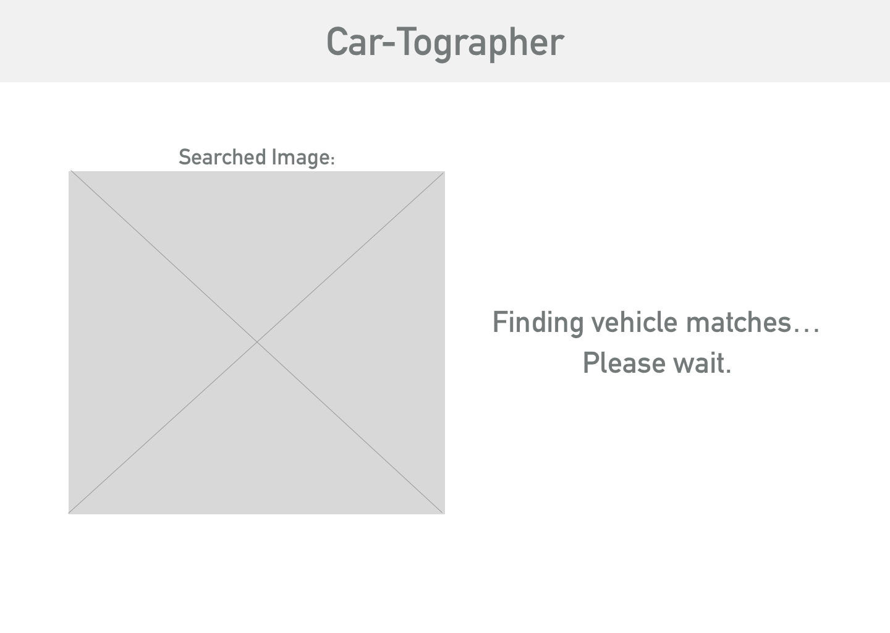
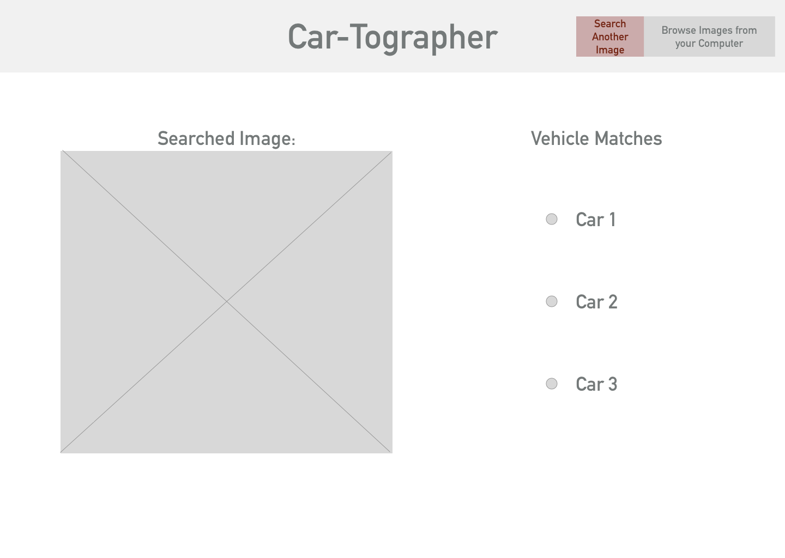
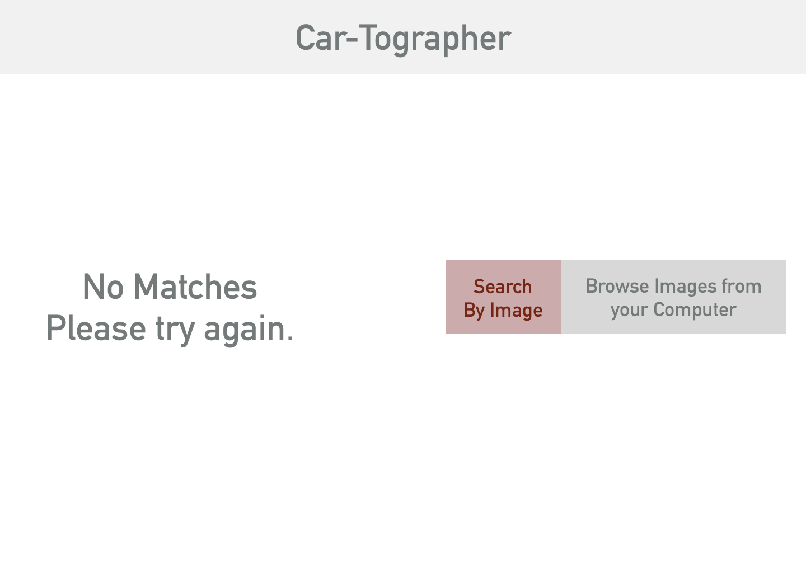
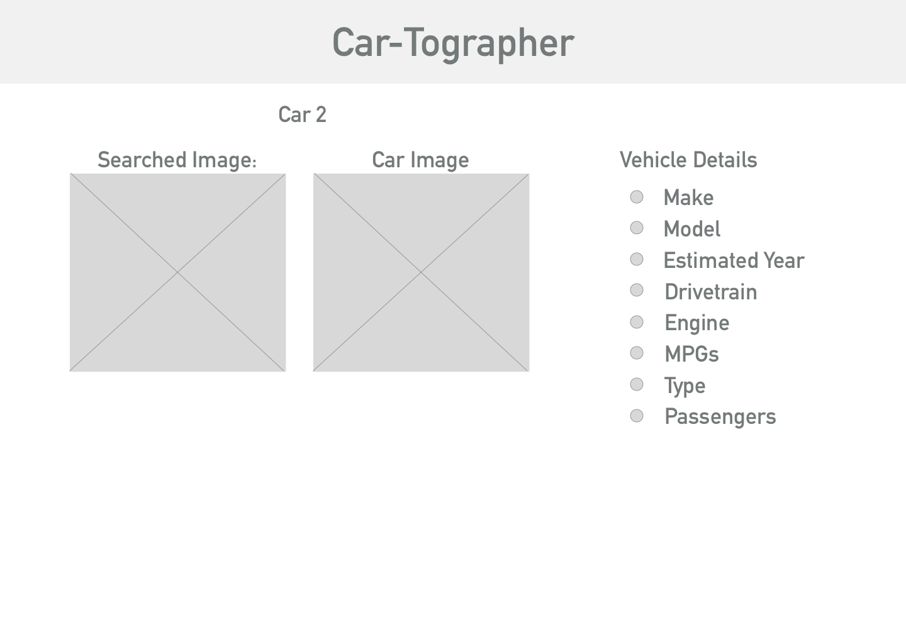

### Student:
Chris Bandrowsky

### Project Name:  
Car-Tographer

#### Check In: 1  

#### Collaborators:  
Working with my very own self.

#### Project Pitch  
Ever see a car driving down the street that you wish you could find out more on? Or have you ever wondered what your partner is talking about as he or she see's that sweet red convertible drive around downtown? With Car-Tographer, a user can upload a photo of that rare car they just saw, and learn more about that vehicle!

### Deliverables  

#### Stack:
-React Javascript application.
-Express backend OR Firebase backend for hosting images, service, authentication calls.

#### APIs:  
-Google Cloud Vision API [Google Cloud Vision API](https://cloud.google.com/vision/)
-Edmunds Vehicle API : [Edmunds Vehicle API](http://edmunds.mashery.com/io-docs)
(if limits on the Edmunds Vehicle API) use [NHTSA Vehicle API for Makes](https://vpic.nhtsa.dot.gov/api/)

#### Wireframes  

#### Waffle.io
https://waffle.io/cbandrow/personal-project  

### Reflection  

#### Order Of Attack  

First things first, I need to get working on the API call to Google Cloud Vision. Which also means, I need to research the best way to host the application: either on Firebase, or using an Express mini server. With that comes the issue of authentication, and the solving that problem.
Once these two steps are set, I can begin working on the actual API call by uploading an image. The image will need changed to Base64 so that the API can translate the data into usable identifiers.
In the meantime, I can also focus on making a couple of calls to the Edmunds API to pull data on makes/models of vehicles. Initially, these calls or stubbed data can be used as matcher for identifying proper vehicles to the image upload.
Once I have the promise back from the Google Cloud call, I can match that to the data, iterate through, and display the most accurate results.

#### MVP
The app takes an image and displays the accurate results of what kind of vehicle has been shown.

#### Nice To Haves   
The main goal is making the Google Vision API work with coordination of an Edmunds API call. If the API calls don't come through, mocking/stubbing the data for that half of the project seems to be the best idea.
Additional "nice to haves" include a login system where users can save the cars they were interested in.

#### Biggest Challenges  
Absolutely, the biggest problem (personally) is understanding how to properly set up the back end. I have a great idea of how to iterate through the data properly once I have it, it's just the hosting, authentication, and nature of trying to make those calls to the Google Cloud Vision API that seems to be the biggest challenge.

In order to get through this, I need to definitely leverage my connections with individuals I know in the industry who have worked on backend applications before. Additionally, I feel like the internet has (relatively) detailed documentation on the API and making those calls. I hope these resources will initially help propel me in the right direction.
