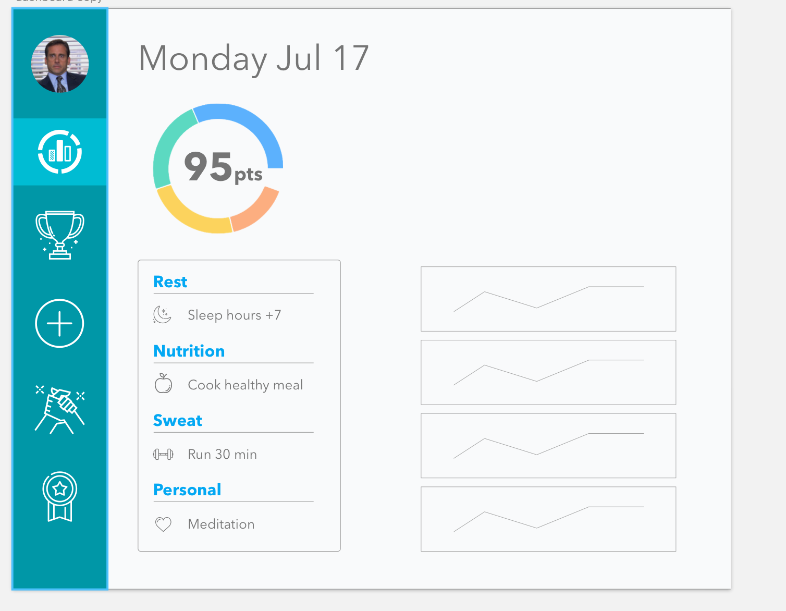

# Lit Wellness Game

#### Check In: 1  

#### Project Pitch :

###### Description

* Make Turing's wellness challenge into a game.
* Great UI/UX to attract more users

###### Sugar and spice!

* Accountability buddy that bets both points (win double or both lose)
* Other players motivation poke/claps

###### Features

* Users can track their own scores
* Easy form to add daily challenge
* Easy way to toggle completed challenge
* Dashboard of progress and notifications
* Cool UI that shows other players scores and challenges
* Recommendations of challenges (saved tags, autocomplete)
* Challenge of the week for extra points
* Rewards to add extra challenge to other players

### Deliverables  

| Stack                   |
|-------------------------|
| React                   |
| Redux                   |
| React Router            |
| Recharts                |
| firebase or express     |
| React styled components |

#### APIs:  

Own backend (firebase or express)

#### Wireframes  

* See sketch

#### Waffle & Github

[Waffle Link](https://waffle.io/jdiejim/wellness-challenge)

[Github Link](https://github.com/jdiejim/wellness-challenge)

#### Order Of Attack  

| Attack                       | Status    |
|------------------------------|-----------|
| Build database schema        | pending   |
| Choose a backend             | completed |
| Home page with instructions  |           |
| Build main components        |           |
| Setup Redux                  | completed |
| Setup Router                 | completed |
| Router map                   |           |
| Sign Up                      |           |
| Login                        |           |
| Profile and dashboard        |           |
| Display users data           |           |
| Add challenges               |           |
| See other people challenges  |           |
| Score calculation            |           |
| Challenge completed logic    |           |
| Displays leaders             |           |
| Unit testing                 |           |

#### MVP

###### Overall

* Track and persist personal wellness data
* See other players scores and progress
* Add challenges
* See other peoples challenges
* user is saved in backend
* tests for your backend
* tests for the front end

###### Dashboard

* Display rest, sweat, nutrition, wellness charts
* Display personal score
* Display day's challenges
* Easy completed toggle

#### Nice To Haves

* Leaders UI to see who is winning
* Rewards - adding challenges to other players
* Challenge of the week
* Accountability buddy!
* Recommendations for challenges
* Display calendar
* Private groups
* Motivation poke/claps

#### Biggest Challenges  

* Add a backend for saving data in a database
* Score calculation (overall math logic)
* Charts
* UX animation
* Race UI
* Calendar persisted data
* Rewards logic
* Accountability buddy logic

#### Instructor Notes

#### Deliverables for next checkin:

| Checkin 1           | Status    |
|---------------------|-----------|
| Node.js and Express | completed |
| Knex with PG        | completed |
| Bookshelf           | pending   |
| Backend testing     | pending   |
| OAuth               | pending   |
| React Setup         | completed |
| Redux Setup         | completed |
| Router Setup        | completed |

#### Next Potential Deliverables

| Checkin 2                | Status    |
|--------------------------|-----------|
| BE: Build pending tables |           |
| BE: add Bookshelf        |           |
| BE: add Bookshelf        |           |
| BE: Backend testing      |           |
| BE: OAuth                |           |
| FE: Side Bar with Routes |           |
| FE: Login w/ post        |           |
| FE: Sign Up  w/ post     |           |
| FE: Get Users activities |           |

#### Instructor Summary Checkin 1

- Have your backend set up
    - look into Node.js / express
    - Knex with PG && Bookshelf
    - look into testing (it's super easy I Promise.all)
    - have your tables set up
        - look into OAuth -> [auth0]('https://auth0.com/docs/quickstart/spa/react/01-login')
- Have your initial react, redux, router setup (boiler plate)
